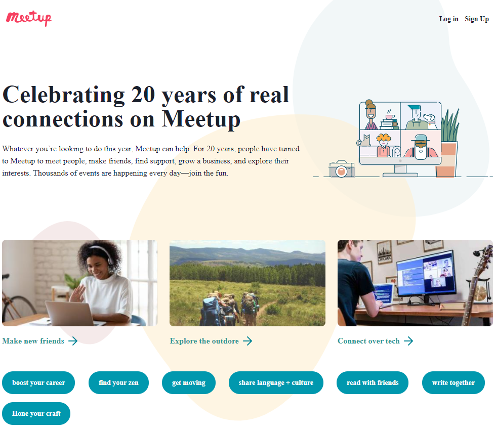

# Meetup.com clone by using react and chakra-ui

This repo is the part of my frot-end development journey. In this project, I have tried to figure out how to use chakra-UI.

## Demo

https://react-meetup-clone.vercel.app/

## Lessons Learned

-   How to use chakra-ui with react.js

-   Different chakra-ui component use case

-   Responsive system of chakra-ui

## Screenshots

## Tech Stack

**Client:** HTML, CSS, Javascript, React, chakra-ui

## 🚀 About Me

I'm a front-end developer with backend knowledge.

## 🛠 Skills

**Front-end** : Javascript, React, Next.js, HTML, CSS, Bootstrap, Tailwind, SASS, SVG, GSAP

**Aditional Backend** : Node.js, Express.js, MongoDB, MySQL

## Acknowledgements

-   [Chakra UI Crash Course](https://www.youtube.com/watch?v=s-bIsz-NR3c)
